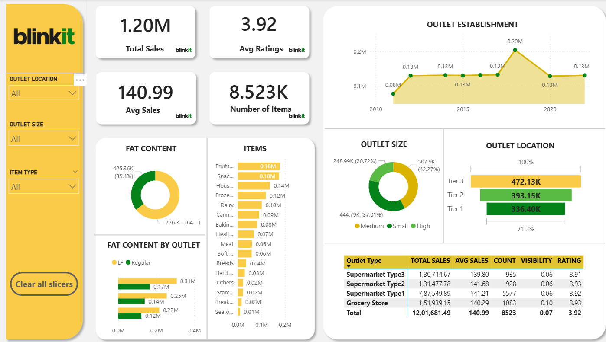

# Blinkit Sales Analysis Dashboard

## Overview

This project presents an end-to-end sales analysis of Blinkit — India's last-minute delivery app — using Power BI. The dashboard provides a comprehensive view of sales performance across outlet types, locations, sizes, and product categories. It is designed to support data-driven decision-making by identifying high-performing segments and uncovering trends in customer purchasing behavior.

---

## Objectives

- Analyze total and average sales across different outlet types and locations
- Understand the impact of fat content on product sales performance
- Examine outlet size and establishment year trends over time
- Compare performance metrics such as visibility, rating, and item count across outlet categories

---

## Dashboard Highlights

| Metric | Value |
|---|---|
| Total Sales | 1.20M |
| Average Sales per Outlet | 140.99 |
| Average Customer Rating | 3.92 |
| Total Number of Items | 8,523 |

---

## Key Insights

- **Outlet Type Performance:** Supermarket Type 1 recorded the highest total sales at 7,87,549.89, accounting for the majority of overall revenue. Grocery Stores and Supermarket Type 2 and Type 3 showed comparable average sales in the range of 139 to 141.
- **Outlet Location:** Tier 3 cities contributed the highest sales volume at 472.13K, outperforming Tier 1 and Tier 2 locations. This indicates a strong market presence in smaller cities.
- **Outlet Size:** Medium-sized outlets dominated with 42.27% of total sales, followed by Small (37.01%) and High (20.72%) outlets.
- **Fat Content Distribution:** Regular fat products contributed approximately 64.6% of total sales, while Low Fat products accounted for 35.4%.
- **Top-Selling Categories:** Fruits and Vegetables along with Snack Foods were the highest-performing item types, each contributing 0.18M in sales.
- **Outlet Establishment Trend:** Sales peaked significantly around 2018 at 0.20M, with relatively stable performance before and after that period.

---

## Tools and Technologies

- **Power BI Desktop** — Dashboard design, data modeling, and visualization
- **Microsoft Excel** — Data cleaning and preprocessing
- **DAX (Data Analysis Expressions)** — Custom measures and calculated columns

---

## Visualizations Included

- KPI Cards for Total Sales, Average Sales, Average Rating, and Number of Items
- Donut Chart for Fat Content distribution
- Bar Chart for Item Type vs Sales
- Clustered Bar Chart for Fat Content by Outlet Type
- Line Chart for Outlet Establishment Year vs Sales
- Donut Chart for Outlet Size distribution
- Horizontal Bar Chart for Outlet Location (Tier-wise)
- Summary Table for Outlet Type with Sales, Rating, Count, and Visibility

---

## Filters and Interactivity

The dashboard includes dynamic slicers for:
- Outlet Location (Tier 1, Tier 2, Tier 3)
- Outlet Size (Small, Medium, High)
- Item Type

All visuals update in real time based on slicer selections, enabling focused analysis of specific segments.

---

## Dataset

- **Source:** Blinkit Grocery Sales Dataset (publicly available)
- **Records:** 8,523 items across multiple outlet types and locations
- **Key Fields:** Item Type, Fat Content, Item Visibility, Outlet Type, Outlet Size, Outlet Location, Outlet Establishment Year, Sales, Rating

---

## Project Structure

```
Blinkit-Sales-Analysis/
│
├── Blinkit_Sales_Dashboard.pbix    # Power BI report file
├── dashboard_screenshot.png        # Dashboard preview image
└── README.md                       # Project documentation
```

---

## Dashboard Preview



---

## Author

**Tharun Kumar Srinivasan**  
Aspiring Data Analyst | Power BI | SQL | Python  
[LinkedIn](https://www.linkedin.com/in/tharunkumarsrini/) | [GitHub](https://github.com/Tharun-Design)

---

## License

This project is intended for educational and portfolio purposes only. The dataset used is publicly available and does not represent any proprietary business data.
